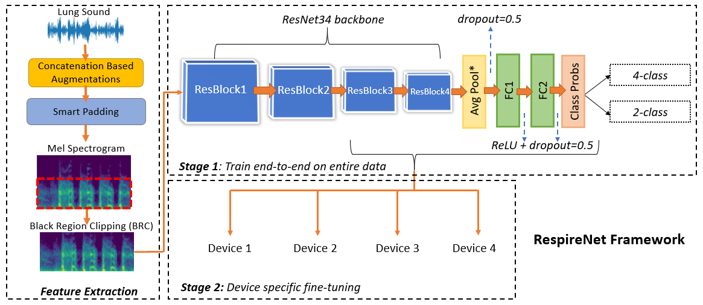
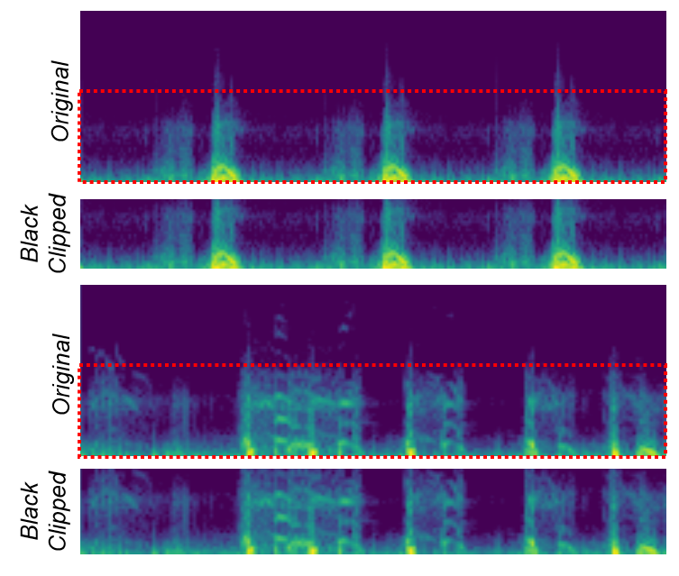
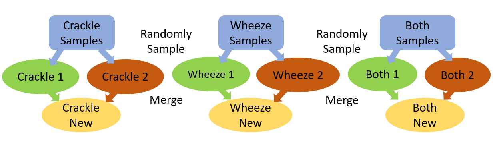

# RespireNet 2020
This is the official implementation of the work **[RespireNet](https://arxiv.org/abs/2011.00196)** which is under-review at **[ICASSP 2021](https://2021.ieeeicassp.org/)**.

## Dependencies:

```
* Python3
* Pytorch (torch, torchvision and other dependencies for Pytorch)
* Numpy
* Librosa (0.8.0)
* nlpaug (0.0.14)
* OpenCV (4.2.0)
* Pandas (0.22.0)
* scikit-learn (0.23.1)
* tqdm (4.48.0)
* cudnn (CUDA for training on GPU)
```

These are all easily installable via, e.g., `pip install numpy`. Any reasonably recent version of these packages shold work.
It is recommended to use a python `virtual` environment to setup the dependencies and the code.

## Dataset
* The dataset used is the **[ICBHI Respiratory Challenge 2017 dataset](https://bhichallenge.med.auth.gr/ICBHI_2017_Challenge)**.
* To find out more details about the dataset please visit the official ICBHI Challenge [webpage](https://bhichallenge.med.auth.gr/ICBHI_2017_Challenge).
* Download from above and place the dataset in the `data` folder.

## Train and Test Script
* We follow both the official `60-40` train-test split as well as the `80-20` split.
* For training we employ a 2-stage training protocol.
* Stage 1: The model is trained end-to-end on train data from all the 4 devices.
* Stage 2: The model is fine-tuned (with a lower learning rate `1e-4`) on only the data from a single device. We do this separately for each device (device specific fine-tuning).

### Train Command:

Stage 1

`python train.py --data_dir ../data/icbhi_dataset/audio_text_data/ --folds_file ../data/patient_list_foldwise.txt --model_path models_out --lr 1e-3 --batch_size 64 --num_worker 4 --start_epochs 0 --epochs 200 --test_fold 4`

Stage 2 (Device specific fine-tuning)

`python train.py --data_dir ../data/icbhi_dataset/audio_text_data/ --folds_file ../data/patient_list_foldwise.txt --model_path models_out --lr 1e-4 --batch_size 64 --num_worker 4 --start_epochs 0 --epochs 50 --test_fold 4 --checkpoint models/ckpt_best.pkl --stetho_id 0
`

replace the `stetho_id` as `0 or 1 or 2 or 3` for devices `0-3`

Please go through our paper for more details.

### Test Command: 

Evaluation script

`python eval.py --data_dir ../data/icbhi_dataset/audio_text_data/ --folds_file ../data/patient_list_foldwise.txt --batch_size 64 --num_worker 4 --test_fold 4 --checkpoint models/ckpt_best.pkl`

## RespireNet Overview

<p align='center'>
      
</p>

## Quantitative Results

### Performance of the proposed model

| Split & Task | Method | Sp |  Se |  Score |
|--------------|:------:|:---:|:---:|:-----:|
| 60-40 split & 4-class| CNN | 71.4% | 39.0%| 55.2%|
|  | CNN+CBA+BRC |  71.8% | 39.6% | 55.7%|
| | CNN+CBA+BRC+FT | 72.3% | 40.1% | 56.2%|
| 80/20 split & 4-class | CNN | 78.8% | 53.6% | 66.2% |
| |CNN+CBA+BRC | 79.7% | 54.4% | 67.1% |
| |CNN+CBA+BRC+FT | 83.3% | 53.7% | 68.5%|
| 80/20 split & 2-class | CNN | 83.3% | 60.5% | 71.9%|
| | CNN+CBA+BRC  | 76.4% | 71.0% |73.7%|
| | CNN+CBA+BRC+FT | 80.9% | 73.1% | 77.0%|

```
Performance comparison of the proposed model with the state-of-the-art systems following random splits. We see significant improvements from our proposed techniques: concatenation-based augmentation (CBA), blank region clipping (BRC) and device specific fine-tuning (FT).
```

### Effect of time window
|Length |  1 sec | 2 sec | 3 sec | 4 sec | 5 sec | 6 sec | 7 sec | 8 sec | 9 sec|
|----------|:-----:|:-----:|:-----:|:-----:|:-----:|:-----:|:-----:|:-----:|:-----:|
|Scores | 56.6% | 59.0% | 60.3% | 61.1% |  62.3% | 64.4% | 66.2% | 65.1% | 65.5%| 

### Some additional results

| Method | Sp |  Se |  Score |
|--------:|:---:|:---:|:-----:|
| CNN + Mixup  | 73.9% | 48.9% | 61.4%|
| CNN + VGGish*| 76.0% | 42.2% | 59.1%|
| Hybrid CNN + Transformer | 75.3% | 49.9% | 63.2%|

```
We also tried experiments with Mixup augmentations, using pre-trained VGGish features and a novel Hybrid CNN + Transformer architecture, however they did not prove to be very useful. 
However transformers with appropriate pretraining have found to be useful in many applications (especially NLP tasks) and may prove to be useful in the future.
```
*[VGGish link](https://github.com/tensorflow/models/tree/master/research/audioset/vggish)*

### About the code ###

* `train.py`: Main trainer code.
* `image_dataloader.py`: Dataloader module.
* `utils.py`: Contains a lot of utility functions for audio file loading, feature extraction, augmentations, etc.
* `eval.py`: Evaluation source files for trained model.
* `scripts`: Directory which contains the runner scripts.
* `nets`: Contains the different network modules.
* `data`: Training-Testing split and should contain the ICBHI data.
* `models`: Contains the trained checkpoint for our proposed framework.

### Blank Region Clipping Scheme

<p align='center'>
      
</p>

### Concatenation Based Augmentation


<center>
<p align='center'>
      
</p>

## To cite this work:
```
@misc{gairola2020respirenet,
      title={RespireNet: A Deep Neural Network for Accurately Detecting Abnormal Lung Sounds in Limited Data Setting}, 
      author={Siddhartha Gairola and Francis Tom and Nipun Kwatra and Mohit Jain},
      year={2020},
      eprint={2011.00196},
      archivePrefix={arXiv},
      primaryClass={cs.SD}
}
```
